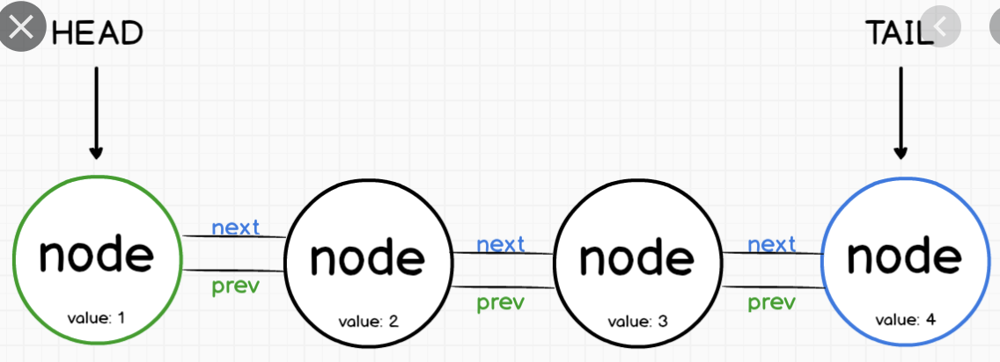

# **WHAT I LEARNED IN  WEEK 13** 
___

    It's Week 13. Time is flying 
    Tell JK I'm still Rowling. - Kejal


## `.forEach`

when we aren't interested in the index and want to do the same thing to each index...


```javascript
students.forEach(function(student){
    console.log(student)
})

```

## `Arrow Function`

Shorter and much simpler way to express functions. Also, allows us to write functions without having to label them!!
NOTE: Do not use for methods.

```javascript
const isComplete = (todo => todo.complete)

```


## `Linked List`

Data structure. Value contains node and an object that contains data with a pointer to the next node in the list. 

Links are pointers to another node object or null if no subsequent node. 



```javascript
const LinkedList = {
head : {
    value :3,
    next : {
        value :15,
        next :{

        }
    }
}
}

const node1 = {
    value :3,
    next:node2
}

const node2 = {
    value :15,
    next:null
}

console.log(linkedList.head.next.value) ==== 3
```


## `Object deconstruction`

Destructuring is useful because it allows you to do in a single line, what would otherwise require multiple lines.

```javascript
  const {species, period, carnivore, extinct} = dinosaur;
```


